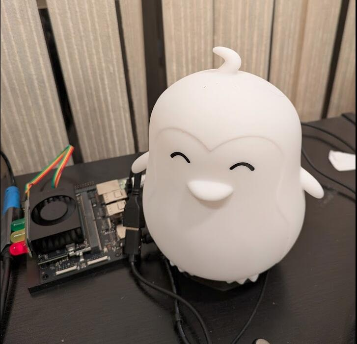

# Kian

A local voice assistant running entirely on-device. Designed for NVIDIA Jetson Orin (8GB), but works on any Linux machine with a microphone.



[Short demo video](https://www.youtube.com/shorts/Z58Afj55yX0)

**Pipeline:** Mic → Silero VAD → faster-whisper (STT) → LLM → Piper (TTS) → Speaker

Three LLM backends:

| Backend | Model | How it runs |
|---------|-------|-------------|
| `server` (default) | Qwen3-4B-Instruct-2507 (GGUF) | llama.cpp HTTP server (CUDA) |
| `ollama` | Qwen3-4B (Q4_K_M) | Ollama server (OpenAI-compatible API) |
| `llamacpp` (deprecated) | Qwen3-4B-Instruct-2507 (GGUF) | In-process via llama-cpp-python |

All components run locally. No cloud APIs required.

## Requirements

- Linux (tested on Jetson Orin, Ubuntu 22.04, JetPack 6.2)
- Python 3.12+ (managed by uv)
- [uv](https://docs.astral.sh/uv/) package manager
- A microphone and speakers/headphones
- ~4GB disk for models
- [Ollama](https://ollama.com/) (only needed for `--backend ollama`)

## System Dependencies

```bash
sudo apt install libportaudio2 libsndfile1
```

These are required by `sounddevice` (audio I/O) and `piper-tts`. On Jetson Orin, these are not installed by default.

### CUDA PATH (Jetson)

Ensure `nvcc` is on your PATH. Add to `~/.bashrc`:

```bash
export PATH="/usr/local/cuda/bin:$PATH"
```

Then `source ~/.bashrc` or open a new terminal.

## Audio Device Setup

Kian uses the system default audio device for both input (mic) and output (speaker). If you're using a USB audio adapter, set it as the default before running Kian.

**GNOME (easiest):** Open Settings > Sound and select your device for both Input and Output.

**Command line (pactl):**

```bash
# List available devices
pactl list sources short   # input devices
pactl list sinks short     # output devices

# Set defaults (replace with your device names)
pactl set-default-source alsa_input.usb-YOUR_DEVICE_NAME.analog-stereo
pactl set-default-sink alsa_output.usb-YOUR_DEVICE_NAME.analog-stereo
```

**Verify:** You can test your audio setup with:

```bash
# Record 3 seconds and play back
arecord -D default -f S16_LE -r 48000 -c 2 -d 3 /tmp/test.wav
aplay -D default /tmp/test.wav
```

## Status LEDs (optional)

Kian can drive a [Pi Traffic Light](https://www.amazon.com/dp/B00RIIGD30) on the Jetson GPIO header to show status: **yellow = idle/listening**, **red = busy (processing)**.

Wire the traffic light to header pins 29 (red), 30 (GND), 31 (yellow), 32 (green — unused).

**First-time setup:**

```bash
sudo bash scripts/enable_gpio.sh
```

Then log out and back in for gpio group permissions to take effect.

**After each reboot**, re-run to configure the pinmux (the pin direction settings don't persist):

```bash
sudo bash scripts/enable_gpio.sh
```

If no GPIO is available (e.g. non-Jetson machine), the LEDs are silently skipped.

## Setup

1. **Install uv** (if you don't have it):

   ```bash
   curl -LsSf https://astral.sh/uv/install.sh | sh
   ```

2. **Install dependencies:**

   ```bash
   uv sync
   ```

3. **Install Ollama** (optional, for `--backend ollama`):

   ```bash
   curl -fsSL https://ollama.com/install.sh | sh
   ```

   Ollama runs as a systemd service and starts automatically on boot.

4. **Download models:**

   ```bash
   bash scripts/download-models.sh
   ```

   This downloads:
   - **Silero VAD** (~2.3MB) into `models/`
   - **Piper TTS** voice (`en_US-lessac-medium`, ~75MB) into `models/`
   - **Qwen3-4B-Instruct-2507** GGUF (`Q4_K_M`, ~2.5GB) into `models/` (default llamacpp model)
   - **Qwen3.5-2B** GGUF (`Q4_K_M`, ~1.6GB) into `models/`
   - **Granite 4.0 Micro** GGUF (`Q4_K_M`, ~2.1GB) into `models/`
   - **Granite 4.0 H-Micro** GGUF (`Q4_K_M`, ~1.9GB) into `models/`
   - **Qwen3-4B** via Ollama (`Q4_K_M`, ~2.7GB)
   - **Granite Guardian HAP 38M** ONNX (quantized INT8, ~126MB) into `models/granite-guardian-hap/` (safety classifier)
   - **Whisper** (`base.en`, ~150MB) is downloaded automatically on first run by faster-whisper

5. **Build llama.cpp with CUDA** (needed for the default `server` backend):

   ```bash
   bash scripts/build-prismml-llama.sh
   ```

   This compiles the PrismML fork of llama.cpp with CUDA support. Takes several minutes.
   Skip this only if you plan to use `--backend ollama` exclusively.

6. **Run:**

   ```bash
   uv run kian
   ```

## Usage

```bash
# Default: Qwen3-4B-Instruct-2507 via llama.cpp server
uv run kian

# Qwen3-4B via Ollama
uv run kian --backend ollama

# Custom GGUF model via llama.cpp server
uv run kian --backend server --model some-other-model.gguf
```

Press Q + Enter to quit.

## Project Structure

```
kian/
├── kian/
│   ├── app.py              # async pipeline wiring everything together
│   ├── vad.py              # voice activity detection (Silero VAD)
│   ├── stt.py              # speech-to-text (faster-whisper)
│   ├── mic.py              # microphone input singleton
│   ├── leds.py             # status LEDs via Jetson GPIO
│   ├── llm.py              # backend selection + shared interface
│   ├── llm_server.py       # llama.cpp HTTP server backend (default)
│   ├── llm_ollama.py       # Ollama backend
│   ├── llm_llamacpp.py     # llama-cpp-python backend (deprecated)
│   ├── safety.py           # ONNX content safety classifier (Granite Guardian HAP)
│   ├── naughty.py          # n-gram prohibited-content matcher
│   ├── wiki.py             # Simple Wikipedia RAG (SQLite + FTS5)
│   ├── latex_to_speech.py  # LaTeX math → spoken English converter
│   └── tts.py              # text-to-speech + playback thread (Piper)
├── models/                 # model files (not checked in)
├── scripts/
│   ├── build-prismml-llama.sh  # build llama.cpp (CUDA) for the server backend
│   ├── build-wiki-db.py        # build the local Wikipedia FTS5 index
│   ├── download-models.sh
│   ├── enable_gpio.sh          # GPIO setup for status LEDs
│   ├── benchmark-llm.py        # per-engine TTFT/tok-s benchmarks
│   ├── benchmark-all.sh        # run the full benchmark suite N times
│   ├── benchmark-table.py      # build docs/benchmark-table.tex + README table
│   ├── qualitative-study.py    # LLM-judge qualitative evaluation
│   └── quality-table.py        # build docs/quality-table.tex
└── pyproject.toml
```

## How It Works

1. **VAD** continuously listens on the mic and detects speech segments
2. **Whisper** transcribes each speech segment to text
3. **LLM** streams a response token-by-token (via llama.cpp or Ollama)
4. Tokens are buffered and split on punctuation boundaries (~25 chars min)
5. Each text fragment is synthesized by **Piper TTS** and queued for playback
6. A background thread plays audio chunks sequentially, so playback starts while the LLM is still generating

## Models

Models are stored in `models/` and excluded from git. You can swap them:

- **LLM (`server`, default):** Any GGUF model under `models/`. Pass `--model some-model.gguf`.
- **LLM (`ollama`):** Pass `--model "model:tag"` with any model from the [Ollama library](https://ollama.com/library).
- **LLM (`llamacpp`, deprecated):** Same GGUF set as `server`, but with pathological post-trim TTFT; prefer `server`.
- **TTS voice:** Browse [Piper voices](https://github.com/rhasspy/piper/blob/master/VOICES.md). Download the `.onnx` + `.onnx.json` pair.
- **Whisper:** Change `MODEL_SIZE` in `kian/stt.py` (`tiny`, `base`, `small`, `medium`).

## Headless Mode (recommended for production / toy use)

Running without the GNOME desktop frees ~1-1.3 GB of RAM, which can allow full GPU offload of the LLM for much faster inference.

**Switch to headless (persists across reboot):**

```bash
sudo systemctl set-default multi-user.target
sudo reboot
```

You'll get a text console login on HDMI with keyboard input. You can also SSH in.

**Switch back to desktop:**

```bash
sudo systemctl set-default graphical.target
sudo reboot
```

**One-time switch (no reboot, no permanent change):**

```bash
# Drop to text console
sudo systemctl isolate multi-user.target

# Go back to desktop
sudo systemctl isolate graphical.target
```

Note: PulseAudio may not auto-start in headless mode. If audio breaks, start it manually:

```bash
pulseaudio --start
```

## Benchmarks (Jetson Orin Nano, 8GB)

Measured over 5 runs x 20 conversational prompts per engine. Unless otherwise noted, models use Q4_K_M quantization and a 2048-token context.

| Engine | Avg TTFT | Max TTFT | Post-Trim Avg | Post-Trim Max | tok/s |
|--------|----------|----------|---------------|---------------|-------|
| server:ibm-granite_granite-4.0-micro-IQ4_XS | 0.10s | 0.21s | 1.17s | 1.32s | 21.6 |
| server:granite-3.3-2b-instruct-Q4_K_M | 0.11s | 0.41s | 1.15s | 1.42s | 24.2 |
| server:granite-4.0-micro-Q4_K_M | 0.11s | 0.22s | 1.42s | 1.65s | 18.1 |
| server:granite-4.0-h-micro-Q4_K_M-c1024 | 0.16s | 0.30s | 1.04s | 1.26s | 17.9 |
| server:granite-4.0-h-micro-Q4_K_M | 0.16s | 0.30s | 2.07s | 2.24s | 17.9 |
| server:qwen3-4b-instruct-2507-q4_k_m | 0.18s | 0.43s | 1.90s | 2.02s | 14.7 |
| ollama:Granite 3.3-2B | 0.24s | 0.45s | 1.13s | 1.41s | 25.8 |
| ollama:Granite 4-3B | 0.36s | 0.47s | 1.32s | 1.56s | 18.5 |
| server:Bonsai-8B | 0.48s | 0.79s | 2.61s | 2.90s | 13.7 |
| ollama:Llama 3.2-3B | 0.53s | 0.63s | 1.41s | 1.66s | 19.1 |
| ollama:Qwen3-4B | 0.64s | 0.93s | 1.91s | 2.19s | 15.3 |
| ollama:Ministral-3 3B | 0.71s | 0.95s | 1.66s | 1.78s | 19.5 |
| server:Qwen3.5-2B-Q4_K_M | 0.72s | 0.92s | 1.11s | 1.18s | 22.9 |
| ollama:gemma3:4b | 0.88s | 1.07s | 2.08s | 2.30s | 15.5 |
| ollama:Qwen3.5-2B | 1.26s | 1.79s | 1.69s | 1.93s | 22.6 |
| ollama:Nemotron-3 Nano 4B | 2.42s | 4.36s | 3.36s | 3.70s | 16.0 |

The default backend is Qwen3-4B-Instruct-2507 via llama.cpp, selected for best latency and no external server dependency.
See the [litepaper](docs/litepaper.tex) for qualitative evaluation details.

## Memory Budget (~8GB, headless)

Running headless (no desktop environment) frees 1--1.3 GB of RAM for GPU offload.

| Component | RAM |
|-----------|-----|
| OS/system (headless) | ~1.0 GB |
| llama.cpp + Qwen3-4B Q4_K_M | ~2.5 GB |
| Safety classifier (CPU) | ~0.1 GB |
| Whisper base.en | ~0.2 GB |
| Piper TTS + VAD | ~0.2 GB |
| KV cache (2K context) | ~0.3 GB |
